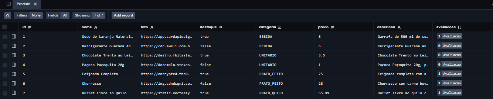
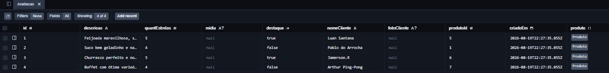
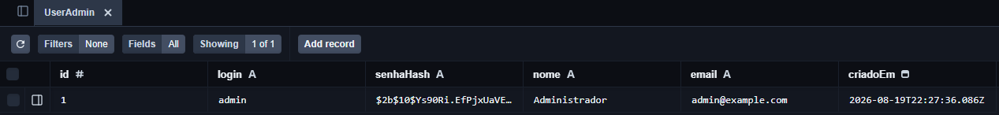

# Bergston Lovers

### Integrantes
Athos Silvano Lopes - https://github.com/AthosMcqueen

Lucas Inácio Mendes - https://github.com/lim2-cmyk

Ryanderson Henzyo Souza e Moura - https://github.com/Ryanderson-GALO

Samuel Miranda de Carvalho - https://github.com/Samuel007b

Sara Augusta de Carvalho Silva - https://github.com/SaraAugusta-sacs2

# Site Institucional do Restaurante Dona Cida

### Descrição:
O Restaurante Dona Cida, renomado ponto comercial no município de Fruta de Leite, pretende inovar e chegar a novos clientes pela internet, então busca-se desenvolver um site institucional, ou seja, uma página web com foco em conversão de novos clientes, induzindo o cliente/usuário a comparecer e prestigiar o restaurante. Deste modo, este site tem como objetivo principal apresentar um conteúdo persuasivo sobre o possível cliente, induzindo o a “dar uma chance” para o restaurante através de fotos, vídeos, representações “idealizadas” do estabelecimento e o uso de cores leves que remetem ao aconchego e à familiarização. O site também possuirá a descrição dos produtos e serviços oferecidos, enfatizando sua qualidade única e artesanal, de modo a convencer os clientes de que aquilo é realmente algo bom.

### Problema a ser solucionado:
Limitação de acesso aos moradores do próprio município de Fruta de Leite (MG), que moram longe do restaurante. Poucos meios de divulgação do restaurante (apenas Instagram e WhatsApp). Falta de rapidez no atendimento ao cliente. Necessidade de criar um ambiente ainda mais aconchegante aos clientes em geral, de modo a melhorar a visibilidade e a imagem do estabelecimento.

### Público alvo:
Possíveis novos clientes do Restaurante Dona Cida, além da proprietária do estabelecimento

### Funcionalidades:
Apresentar os produtos (pratos servidos pelo restaurante) aos clientes, incluindo fotos, descrições, avaliações e preço. Obter avaliações e feedbacks, para corrigir possíveis problemas e realizar possíveis melhorias na interação com o cliente. Conversão de novos clientes a partir das divulgações de eventos, ou simplesmente pelo cardápio. Divulgação de promoções especiais periódicas, com foco na familiarização e venda de pratos novos. Mostrar os valores e diferenciais do restaurante de modo a destacá-lo regionalmente.

### Wireframe - Figma: https://www.figma.com/design/bcVaZHdqi5LrzrUorzMwzM/Wireframe---Site-Dona-Cida

## Modelo Conceitual
### Link: [db/conceitual.png](./db/conceitual.png)

### Entidades:
Produto: Classe que representa os alimentos comercializados no restaurante, possuindo a chave primária ID (uníca, obrigatória e autoincrementada) e os atributos foto (obrigatório), nome (obrigatório e único), destaque (obrigatório), preço (obrigatório), descrição (obrigatório) e categoria (obrigatória e que pode ser do tipo bebida, unitário, prato feito ou prato quilo).

UserAdmin: Classe que representa o usuário administrativo da aplicação, possuindo a chave primária ID (uníca, obrigatória e autoincrementada), além dos atributos login (obrigatório e único), senhaHash (obrigatório e nunca retornado em consultas da API) e criadoEm (criado automaticamente e que registra o instante exato de criação). Esta é uma entidade especial que não possui nenhum relacionamento com outras entidades, apenas tem a funcionalidade de autenticação no site administrativo da aplicação.

### Relacionamentos:
Avaliacao recebe Produto: Relacionamento 1:N entre Produto e Avaliacao. Em avaliacao, o campo produtoId é a chave estrangeira (FK) obrigatória que referencia a chave primária id de Produto (produto). Cada avaliação deve obrigatoriamente pertencer a exatamente 1 produto (1,1), enquanto um produto pode possuir de 0 a N avaliações.

## Modelo Lógico
### Link: [prisma/schema.prisma](./prisma/schema.prisma)

## Modelo Físico
### Link: [prisma/seed.js](./prisma/seed.js)

## Evidência funcional
Prints das tabelas do BD feitos a partir do Prisma Studio após executar `npx prisma migrate dev` e `npx prisma generate` (construindo fisicamente as tabelas do BD) e `npx prisma db seed` (cadastrando novos registros/linhas).

