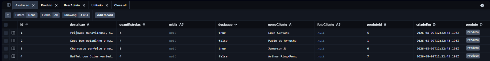

# Bergston Lovers

### Integrantes
Athos Silvano Lopes - https://github.com/AthosMcqueen

Lucas Inácio Mendes - https://github.com/lim2-cmyk

Ryanderson Henzyo Souza e Moura - https://github.com/Ryanderson-GALO

Samuel Miranda de Carvalho - https://github.com/Samuel007b

Sara Augusta de Carvalho Silva - https://github.com/SaraAugusta-sacs2

# Site Institucional do Restaurante Dona Cida

### Descrição:
O Restaurante Dona Cida, renomado ponto comercial no município de Fruta de Leite, pretende inovar e chegar a novos clientes pela internet, então busca-se desenvolver um site institucional, ou seja, uma página web com foco em conversão de novos clientes, induzindo o cliente/usuário a comparecer e prestigiar o restaurante. Deste modo, este site tem como objetivo principal apresentar um conteúdo persuasivo sobre o possível cliente, induzindo o a “dar uma chance” para o restaurante através de fotos, vídeos, representações “idealizadas” do estabelecimento e o uso de cores leves que remetem ao aconchego e à familiarização. O site também possuirá a descrição dos produtos e serviços oferecidos, enfatizando sua qualidade única e artesanal, de modo a convencer os clientes de que aquilo é realmente algo bom.

### Problema a ser solucionado:
Limitação de acesso aos moradores do próprio município de Fruta de Leite (MG), que moram longe do restaurante. Poucos meios de divulgação do restaurante (apenas Instagram e WhatsApp). Falta de rapidez no atendimento ao cliente. Necessidade de criar um ambiente ainda mais aconchegante aos clientes em geral, de modo a melhorar a visibilidade e a imagem do estabelecimento.

### Público alvo:
Possíveis novos clientes do Restaurante Dona Cida, além da proprietária do estabelecimento

### Funcionalidades:
Apresentar os produtos (pratos servidos pelo restaurante) aos clientes, incluindo fotos, descrições, avaliações e preço. Obter avaliações e feedbacks, para corrigir possíveis problemas e realizar possíveis melhorias na interação com o cliente. Conversão de novos clientes a partir das divulgações de eventos, ou simplesmente pelo cardápio. Divulgação de promoções especiais periódicas, com foco na familiarização e venda de pratos novos. Mostrar os valores e diferenciais do restaurante de modo a destacá-lo regionalmente.

### Wireframe - Figma: https://www.figma.com/design/bcVaZHdqi5LrzrUorzMwzM/Wireframe---Site-Dona-Cida

## Modelo Conceitual
### Link: [db/conceitual.png](./db/conceitual.png)

### Entidades:
Produto: ...
    Superclasse que possui a chave primária ID (uníca,obrigatória e autoincrement) e os atributos Foto(obrigatório), Nome(obrigatório e único) e Destaque(obrigatório)

Bebida: ...
    Subclasse de Produto que possui a chave primária estrangeira id e produtoId(única e obrigatória, referenciando Produto), e os atributos volume(obrigatório), marca(obrigatório) e preco(obrigatório).

Unitario: ...
    Subclasse de Produto que possui a chave primária entrangeira id e produtoId (única e obrigatória, referenciando Produto), e os atributos marca (obrigatório) e precoUni (obrigatório).

PratoFeito: ...
    Subclasse de Produto que possui a chave primária estrangeira id e produtoId (única e obrigatória, referenciando Produto), e o atributo preco(obrigatório).

PratoQuilo: ...
    Subclasse de Produto que possui a chave primária estrangeira id e produtoId (única e obrigatória, referenciado Produto), e o atributo precoKg (obrigatório)

### Relacionamentos:
Avaliacao recebe Produto: ...
    Relacionamento 1:N entre Produto e Avaliacao. Em avaliacao, o campo produtoId é a chave estrangeira (FK) obrigatória que referencia a chave primária id de Produto (produto). Cada avaliação deve obrigatoriamente pertencer a exatamente 1 produto (1,1), enquanto um produto pode possuir de 0 a N avaliações.

Bebida herda de Produto: ...
    Relacionamento 1:1 de especialização/herança. A entidade Bebida possui chave estrangeira (FK) produtoId obrigatória e única, que também atua como chave primária (PK) referenciando o id de produto. Na entidade Produto, o campo bebida é opcional, tornando a relação (0,1) do lado de Produto e (1,1) do lado de Bebida.

Unitario herda de Produto: ...
    Relacionamento 1:1 de especialização/herança. A entidade Unitario possui a chave estrangeira (FK) produtoId obrigatória e única, que também atua como chave primária (PK) referenciando o id de Produto. Na entidade Produto, o campo unitario é opcional tornando a relação(0,1) do lado de Produto e (1,1) do lado de Unitario

PratoFeito herda de Produto: ...
    Relacionamento 1:1 de especialização/herança. A entidade PratoFeito possui a chave estrangeira(FK) produtoId obrigatória e única, que também atua como chave primária (PK) referenciando o id de Produto. Na entidade Produto, o campo pratoFeito é opcional, tornando a relação(0,1) do lado de Produto e (1,1) do lado de PratoFeito.

PratoQuilo herda de Produto: ...
    Relacionamento 1:1 de especialização/herança. A entidade PratoQuilo possui a chave estrangeira (FK) produtoId obrigatória e única, que também atua como chave primária (PK) referenciando o id de Produto. Na entidade Produto, o campo pratoQuilo é opcional, tornando a relação (0,1) do lado de Produto e (1,1) do lado de PratoQuilo.

## Modelo Lógico
### Link: [prisma/schema.prisma](./prisma/schema.prisma)

## Modelo Físico
### Link: [prisma/seed.js](./prisma/seed.js)

## Evidência funcional
Prints das tabelas do Neon após rodar `npx prisma migrate dev` e `npx prisma db seed`.

